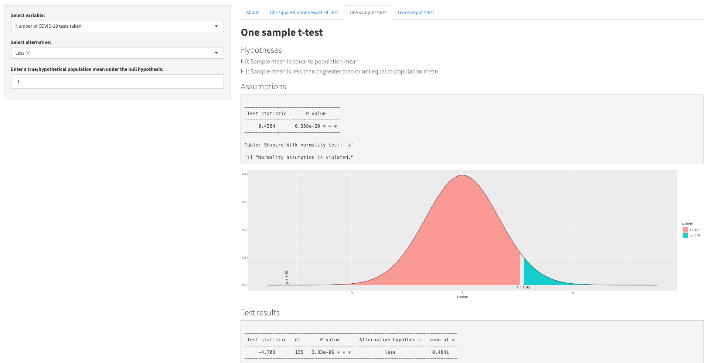

# Data Science Portfolio
---
## COVID-19 Data Analysis

### NSW COVID-19 Hotspot Analysis

Gathered and integrated several datasets to perform a data analysis of the viral vulnerability of different neighbourhoods in Sydney. The vulnerability score was computed for all suburbs in the greater Sydney region which is a measure of several factors that affect the spread of a virus within a community such as: population density, age distribution, pre-existing health conditions, and access to healthcare services.

---
### Dynamic Hypothesis Testing App

Created an R Shiny app to visualise the relationship between COVID-19 and other student lifestyle factors. The following dynamic hypothesis tests were supported: Chi-squared Goodness of Fit Tests for Uniformity Tests, Chi-squared Test for Independence Tests, One sample t-test Tests and Two sample t-test for unequal population variance.

---
## Predictive Health Analysis

### Diabetes Prediction using Weka Classifiers

This study aimed to assess the performance of classifiers that predict the presence of diabetes for individuals of Pima Indian heritage, with a focus on the effect of Correlation-based Feature Selection.

---
### Bodyfat Regression Analysis

A series of multiple linear regression models were developed aiming to predict body fat percentage for males based on the measurements of 250 men of various ages. The final model was selected on the basis of out of sample performance using cross-validation.

---
## Social Sciences

### Factors Explaining Support for Gun Control in the U.S

This study aimed to identify which sociocultural and demographic factors best explain support for gun control in America. A logistic regression based approach was used to assess the importance of the predictors.

