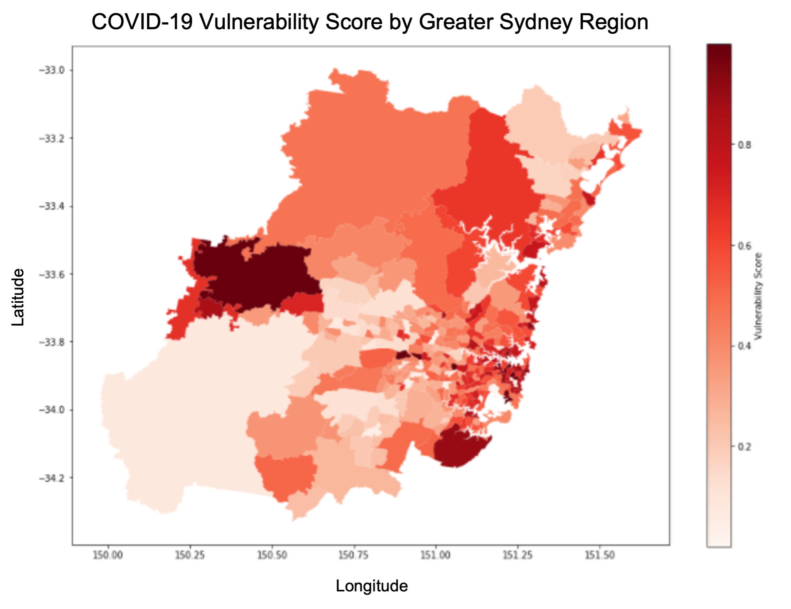
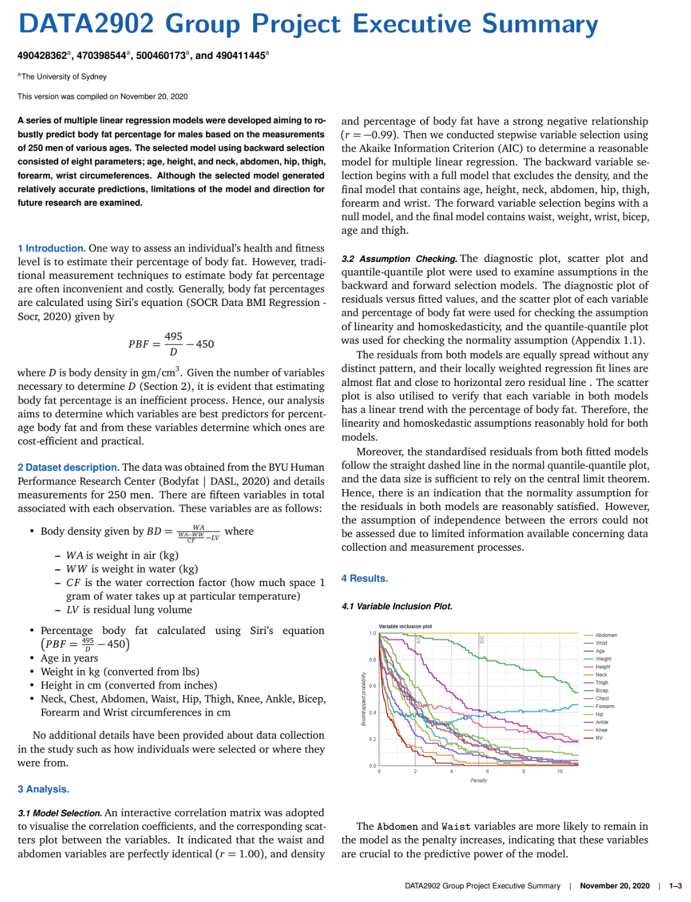

# Data Science Portfolio
---

## NSW COVID-19 Hotspot Prediction Analysis
Gathered and integrated several datasets to perform a data analysis of the *viral vulnerability* of different neighbourhoods in Sydney. The vulnerability score was computed for all suburbs in the greater Sydney region which is a measure of several factors that affect the spread of a virus within a community such as: population density, age distribution, pre-existing health conditions, and access to healthcare services.

---

## ML Diabetes Prediction
---

## Bodyfat Regression Analysis
 

