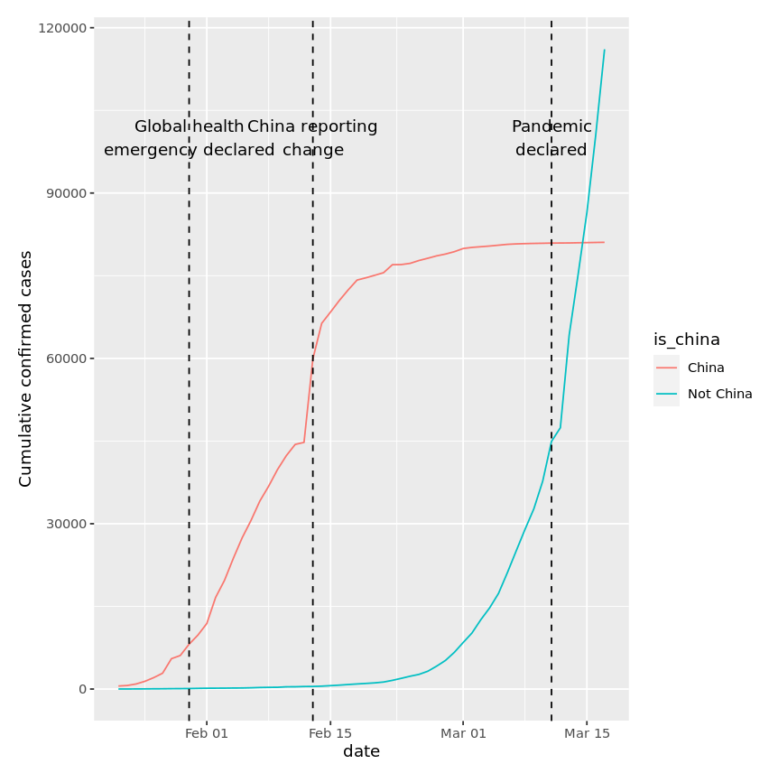
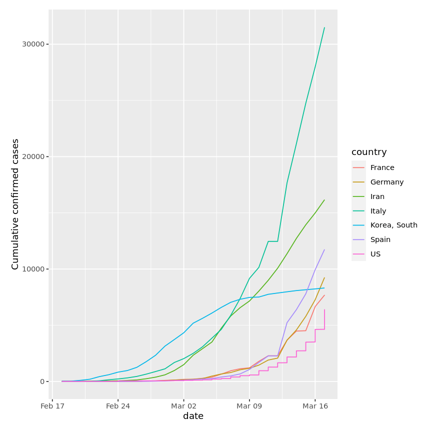

# Data Science Portfolio
---

## COVID-19 Analysis

### NSW COVID-19 Hotspot Analysis

Gathered and integrated several datasets to perform a data analysis of the viral vulnerability of different neighbourhoods in Sydney. The vulnerability score was computed for all suburbs in the greater Sydney region which is a measure of several factors that affect the spread of a virus within a community such as: population density, age distribution, pre-existing health conditions, and access to healthcare services.

---

### Visualising COVID-19 Outbreak

Visualised COVID-19 data from the first several weeks of the outbreak to see at what point this virus became a global pandemic using R.

 

 
---
## Predictive Health Analysis

### ML Diabetes Prediction

This study aimed to assess the performance of classifiers that predict the presence of diabetes for individuals of Pima Indian heritage, with a focus on the effect of Correlation-based Feature Selection.

---

### Bodyfat Regression Analysis

 A series of multiple linear regression models were developed aiming to predict body fat percentage for males based on the measurements of 250 men of various ages. The final model was selected on the basis of out of sample performance using cross-validation.

 

