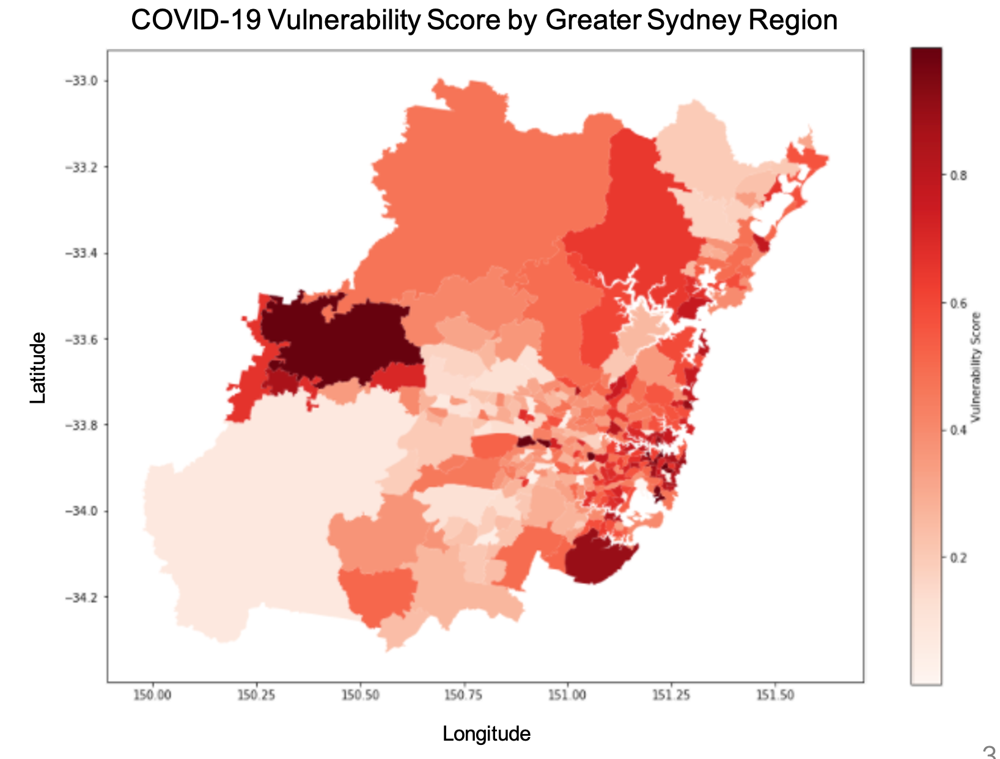

# Data Science Portfolio
---

## NSW COVID-19 Hotspot Prediction Analysis
Gathered and integrate several datasets to perform a data analysis of the *viral vulnerability* of different neighbourhoods in Sydney. The vulnerability score was computed using the folloiwng formula $$ vulnerability=S(z(population_density)+z(population_age)-z(healthservice_density)-z(hospitalbed_density)+z(intratravel_area)+z(netarea_travel)) $$

---

## ML Diabetes Prediction
---

## Bodyfat Regression Analysis
---

